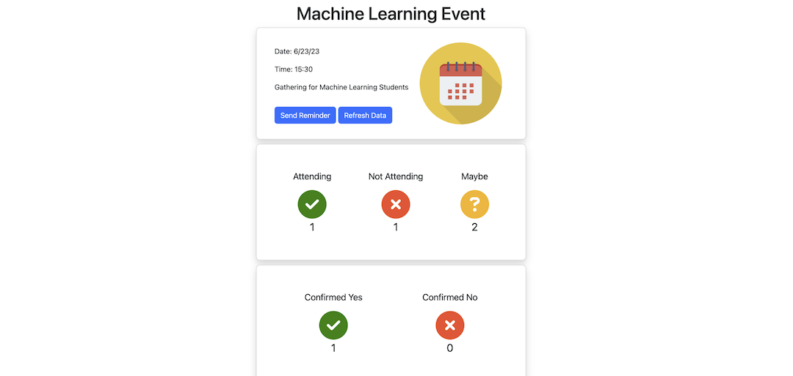

<!-- Improved compatibility of back to top link: See: https://github.com/othneildrew/Best-README-Template/pull/73 -->
<a name="readme-top"></a>
<!--
*** Thanks for checking out the Best-README-Template. If you have a suggestion
*** that would make this better, please fork the repo and create a pull request
*** or simply open an issue with the tag "enhancement".
*** Don't forget to give the project a star!
*** Thanks again! Now go create something AMAZING! :D
-->


<!-- PROJECT SHIELDS -->
<!--
*** I'm using markdown "reference style" links for readability.
*** Reference links are enclosed in brackets [ ] instead of parentheses ( ).
*** See the bottom of this document for the declaration of the reference variables
*** for contributors-url, forks-url, etc. This is an optional, concise syntax you may use.
*** https://www.markdownguide.org/basic-syntax/#reference-style-links
-->
<!-- [![Contributors][contributors-shield]][contributors-url]
[![Forks][forks-shield]][forks-url]
[![Stargazers][stars-shield]][stars-url]
[![Issues][issues-shield]][issues-url]
[![MIT License][license-shield]][license-url]
[![LinkedIn][linkedin-shield]][linkedin-url] -->


<!-- PROJECT LOGO -->
<br />
<div align="center">
  <a href="https://github.com/github_username/repo_name">
    
  </a>

<h3 align="center">Attendee Tracker</h3>

  <p align="center">
    Track participants for your events and send reminders (integrated with Google Forms API)
    <br />
    <br />
    <br />
  </p>
</div>


<!-- TABLE OF CONTENTS -->
<details>
  <summary>Table of Contents</summary>
  <ol>
    <li>
      <a href="#about-the-project">About The Project</a>
      <ul>
        <li><a href="#built-with">Built With</a></li>
      </ul>
    </li>
    <li>
      <a href="#getting-started">Getting Started</a>
      <ul>
        <li><a href="#installation">Installation</a></li>
      </ul>
    </li>
    <li><a href="#usage">Usage</a></li>
    <li><a href="#contact">Contact</a></li>
  </ol>
</details>


<!-- ABOUT THE PROJECT -->
## About The Project


This app provides users with the ability to track attendance to their events. By inputting the google forms link with which they invited participants, users are able to view a dashboard with attendance information, including who is attending, not attending, and maybe attending. Users are also able to send automated email reminders to participants, asking them to confirm their attendance status. This confirmation data is then also displayed on the dashboard.  

<p align="right">(<a href="#readme-top">back to top</a>)</p>


### Built With

* [![React][React.js]][React-url]


<p align="right">(<a href="#readme-top">back to top</a>)</p>

<!-- GETTING STARTED -->
## Getting Started

### Installation

1. Create a free Google OAuth2.0 Client ID  at [https://support.google.com/cloud/answer/6158849?hl=en](https://support.google.com/cloud/answer/6158849?hl=en)
2. Place the Client ID in googleFormApi.js in line 5
   ```js
   var YOUR_CLIENT_ID = enter_key_here
   ```
3. Give developers access to use Client ID in Google Cloud Console, or publish app to give any Google user access 
4. Clone the repo
   ```sh
   git clone https://github.com/cs394-s23/attendeeTracker.git
   ```
5. Install NPM packages
   ```sh
   npm install i
   ```
6. Create a realtime database using firebase at [https://firebase.google.com/](https://firebase.google.com/)

7. Update the firebase config in firebase.js to link firebase realtime database to app
   ```js
   const firebaseConfig = {enter config here}
   ```
8. Sign up for an emailjs account at [https://www.emailjs.com/](https://www.emailjs.com/), and enter ID and service keys in Reminder.jsx
   ```js
   const serviceID = "enter id";
   const templateID = "enter id"; 
   const publicKey = "enter key";
   ```

<p align="right">(<a href="#readme-top">back to top</a>)</p>


<!-- USAGE EXAMPLES -->
## Usage

First, sign in with a google account and click "continue" to access the home screen. If the continue button fails to respond, clear your browser cache and reload. To add an event to the home page, press the "Add Event" button in the navbar. Then, add the editor URL of the google form (not the invite URL) with which you invited participants. 


Note that the google form must follow this template. Specifically, it must begin with the event time (in the form mm-dd-yy-hh-mm) and host name. Then, there must be a yes/no/maybe multiple choice question for attendance.


To view the event dashboard, click on the event in the home page. Then, to send reminders, press the add reminder button on the dashboard. This will send an email to all of the original form responders using Emailjs. It will send a link to the original attendance form with an added question to confirm attendance.

There is also a "refresh data" button that will pull any new form responses to keep the attendance information up to date.



By pressing each of the attendance icons on the dashboard, a modal screen will appear with a list of who is attending, not attending, or maybe attending.

<p align="right">(<a href="#readme-top">back to top</a>)</p>


<!-- CONTACT -->
## Contact

Eric Ma - ericma2024@u.northwestern.edu <br />
Alex Tang - alexandertang2024@u.northwestern.edu <br />
Lena Sauter - lenasauter2023@u.northwestern.edu <br />
Yiran Mo - yiranmo2023@u.northwestern.edu <br />
Josh Levitas - joshualevitas2022@u.northwestern.edu <br />
Sungbin Yun - sungbinyun2025@u.northwestern.edu <br />


Project Link: [https://github.com/cs394-s23/attendeeTracker](https://github.com/cs394-s23/attendeeTracker)

<p align="right">(<a href="#readme-top">back to top</a>)</p>


<!-- MARKDOWN LINKS & IMAGES -->
<!-- https://www.markdownguide.org/basic-syntax/#reference-style-links -->
[contributors-shield]: https://img.shields.io/github/contributors/github_username/repo_name.svg?style=for-the-badge
[contributors-url]: https://github.com/github_username/repo_name/graphs/contributors
[forks-shield]: https://img.shields.io/github/forks/github_username/repo_name.svg?style=for-the-badge
[forks-url]: https://github.com/github_username/repo_name/network/members
[stars-shield]: https://img.shields.io/github/stars/github_username/repo_name.svg?style=for-the-badge
[stars-url]: https://github.com/github_username/repo_name/stargazers
[issues-shield]: https://img.shields.io/github/issues/github_username/repo_name.svg?style=for-the-badge
[issues-url]: https://github.com/github_username/repo_name/issues
[license-shield]: https://img.shields.io/github/license/github_username/repo_name.svg?style=for-the-badge
[license-url]: https://github.com/github_username/repo_name/blob/master/LICENSE.txt
[linkedin-shield]: https://img.shields.io/badge/-LinkedIn-black.svg?style=for-the-badge&logo=linkedin&colorB=555
[linkedin-url]: https://linkedin.com/in/linkedin_username
[product-screenshot]: images/screenshot.png
[Next.js]: https://img.shields.io/badge/next.js-000000?style=for-the-badge&logo=nextdotjs&logoColor=white
[Next-url]: https://nextjs.org/
[React.js]: https://img.shields.io/badge/React-20232A?style=for-the-badge&logo=react&logoColor=61DAFB
[React-url]: https://reactjs.org/
[Vue.js]: https://img.shields.io/badge/Vue.js-35495E?style=for-the-badge&logo=vuedotjs&logoColor=4FC08D
[Vue-url]: https://vuejs.org/
[Angular.io]: https://img.shields.io/badge/Angular-DD0031?style=for-the-badge&logo=angular&logoColor=white
[Angular-url]: https://angular.io/
[Svelte.dev]: https://img.shields.io/badge/Svelte-4A4A55?style=for-the-badge&logo=svelte&logoColor=FF3E00
[Svelte-url]: https://svelte.dev/
[Laravel.com]: https://img.shields.io/badge/Laravel-FF2D20?style=for-the-badge&logo=laravel&logoColor=white
[Laravel-url]: https://laravel.com
[Bootstrap.com]: https://img.shields.io/badge/Bootstrap-563D7C?style=for-the-badge&logo=bootstrap&logoColor=white
[Bootstrap-url]: https://getbootstrap.com
[JQuery.com]: https://img.shields.io/badge/jQuery-0769AD?style=for-the-badge&logo=jquery&logoColor=white
[JQuery-url]: https://jquery.com 
